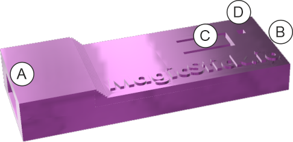
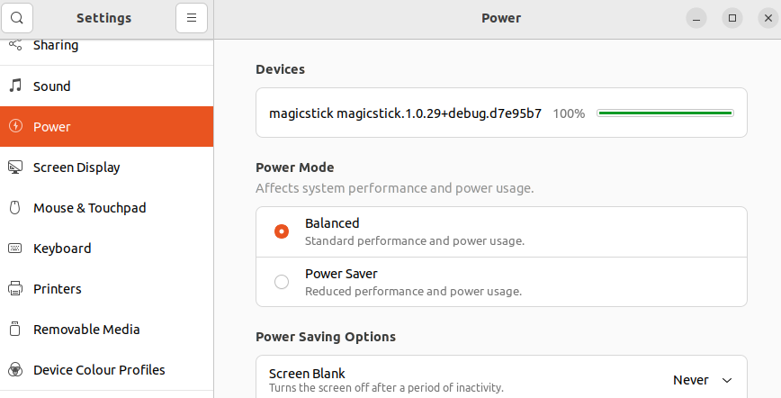
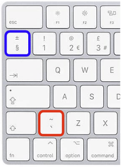
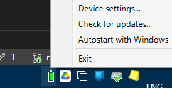
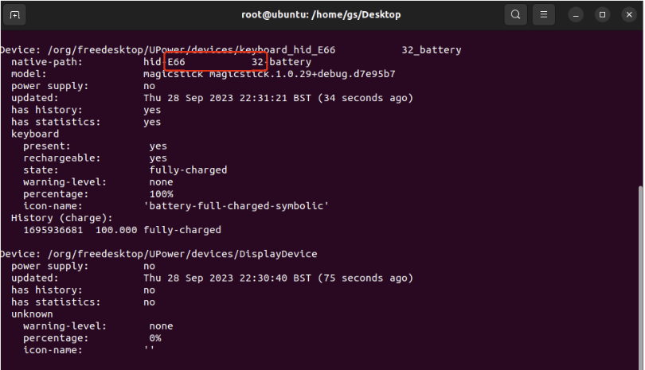

[](https://github.com/samartzidis/magicstick.io)
###### Apple Keyboard USB Adapter for PC

# User Manual



| Label | Description |
| -------- | ------- |
| **A** | **Keyboard** connection, USB Type-A port. |
| **B** | **PC** connection, micro-USB port. |
| **C** | **BOOTSEL**/**RESET** button. |
| **D** | Operation **LED** |

## Connecting a Keyboard

### Wired Connection

This is the simplest mode of connection and your keyboard should just work by plugging it into the USB-A female port (the bigger USB port) of the device labelled **A** in the diagram. You will need a **USB-A to Firewire** cable.

The micro-USB connection labelled **B** must be connected to one of your PC's USB ports.

### Bluetooth Connection

#### Connecting the Newer A1644, A2450, A2449 Keyboards

Connecting any of these keyboards is pretty straightforward. 

1. Remove any keyboard currently plugged-in to magicstick.io.
2. Turn the keyboard off and then on again. 

   

3. Plug the magicstick.io device to a USB port and keep it close to the keyboard. magicstick.io should discover the keyboard and pair with it. There is no PIN code entry required.

#### Connecting the Older [A1314](https://en.wikipedia.org/wiki/Apple_Wireless_Keyboard#/media/File:Apple-wireless-keyboard-aluminum-2007.jpg) Keyboard

The older A1314 keyboard has a little bit more complicated pairing process. 

**Important:** Make sure that the magicstick.io device is first **reset to factory settings**, so that it holds no previous paired keyboard data in its internal memory, by following [these steps](#Factory-Resetting-the-Device).

1. Remove any keyboard currently plugged-in to magicstick.io.
2. Turn the A1314 keyboard off by constantly pressing the right side button for a few seconds. You will see the green keyboard led powering off in a fading out fashion.
3. Turn the A1314 keyboard on by constantly pressing the right side button for a few seconds. Keep pressing it until the green led starts flashing. The keyboard is now in discovery mode.
4. (Unplug if plugged-in and) plug-in again your magicstick.io device to a PC USB port. magicstick.io will try to discover the keyboard. When the magicstick.io LED starts flashing non-stop, the keyboard is discovered and pairing has started. Immediately type **0000** (that is, four zeros) on the keyboard and press <kbd>Enter</kbd>.
5. The keyboard should be now paired and connected.
If this process fails repeat from step 1.

## The MagicStickUI Utility

The MagicStickUI utility allows you to monitor the keyboard's connection status, the battery level (both when wired or in Bluetooth),


as well as to change the keyboard's special keys configuration. You can also use it for permanently turning the magicstick.io Bluetooth chip on or off, for instance if you are in a very high IT security work environment.


Download the latest MagicStickUI msi installer version from the [magicstick.io GitHub Releases](https://github.com/samartzidis/magicstick.io/releases) page.

MagicStickUI is not available on Linux yet, but at least Linux has native support for showing the devices battery level. E.g. on Ubuntu Linux you can directly use the system's Settings application as shown below,



which readily recognises magicstick.io and shows the connected keyboard's battery level.

## LED Status Reference

The LED is located at the diagram position marked **D**. The following table summarizes the various LED flashing states of the device:

| LED Status | Meaning |
|------------|---------|
| LED is **on**. | A keyboard is connected via wired or Bluetooth connection. |
| LED is **off**. | Device malfunction. |
| LED is **flashing** non-stop. | Two possible reasons: </br> Either </br>1. Bluetooth has initiated **pairing** mode. Depending on the keyboard model you may need to enter **0000** and press <kbd>Enter</kbd> on the keyboard to complete pairing or just wait, see [Connecting a Keyboard](#Connecting-a-Keyboard) for details. <br> _Or_ </br>2. The keyboard is in key **programming** mode, waiting for you to press a key to program. |
| **1 flash** and a pause. | **IDLE**. magicstick.io is operational but no keyboard is connected via wire connection or Bluetooth. |
| **2 flashes** and a pause. | **Bluetooth** **CONNECTING**. magicstick.io Bluetooth is trying to connect to an already paired keyboard via Bluetooth. |
| **3 flashes** and a pause. | **Bluetooth** **INQUIRING**. magicstick.io Bluetooth is in inquiry (aka discovery) mode trying to discover and pair with a suitable keyboard nearby. |

## Keymap

When you connect your keyboard for the first time, this is the default keymap:

| Input Key(s)  | Output Key    |
| --- | --- |
| <kbd>Left Ctrl</kbd>  | <kbd>Fn</kbd> |
| <kbd>Fn</kbd> | <kbd>Left Ctrl</kbd> |
| <kbd>⏏︎ Eject</kbd> | <kbd>Del</kbd> |
| <kbd>🔒 Lock</kbd> | <kbd>Del</kbd> |
| <kbd>⌘ Cmd</kbd>  | <kbd>Alt</kbd>    |
| <kbd>⌥ Alt/Option</kbd>  | <kbd>Cmd</kbd>    |
| <kbd>Fn</kbd>+<kbd>[F1]</kbd>...<kbd>[F6]</kbd> | <kbd>[F13]</kbd>...<kbd>[F18]</kbd> |
| <kbd>Fn</kbd>+<kbd>[F7]</kbd>...<kbd>[F12]</kbd> | Multimedia Keys</kbd> |
| <kbd>Fn</kbd>+<kbd>LCtrl</kbd>    | <kbd>Right Ctrl</kbd> |
| <kbd>Fn</kbd>+<kbd>Return</kbd>   | <kbd>Insert</kbd> |
| <kbd>Fn</kbd>+<kbd>⌫</kbd>    | <kbd>Del</kbd>    |
| <kbd>Fn</kbd>+<kbd>P</kbd>    | <kbd>Print Screen</kbd> |
| <kbd>Fn</kbd>+<kbd>S</kbd>    | <kbd>Scroll Lock</kbd> |
| <kbd>Fn</kbd>+<kbd>B</kbd>    | <kbd>Pause/Break</kbd> |
| <kbd>Fn</kbd>+<kbd>&uarr;</kbd>   | <kbd>Page Up</kbd> |
| <kbd>Fn</kbd>+<kbd>&darr;</kbd>   | <kbd>Page Down</kbd> |
| <kbd>Fn</kbd>+<kbd>&larr;</kbd>   | <kbd>Home</kbd>   |
| <kbd>Fn</kbd>+<kbd>&rarr;</kbd>   | <kbd>End</kbd>    |

### Special Function Keys

| Input Key(s)  | Action        |
| --- | --- |
| <kbd>Fn</kbd>+<kbd>Z</kbd>    | Remap (program) key.   |
| <kbd>Fn</kbd>+<kbd>X</kbd>    | Delete a previously remapped (programmed) key.  |
| <kbd>Fn</kbd>+<kbd>Right Shift</kbd>  | Reboot device device in BOOTSEL mode. |
| <kbd>Fn</kbd>+<kbd>Right Shift</kbd>+<kbd>⏏︎ Eject</kbd>   | Erase (factory reset) device.  |
| <kbd>Fn</kbd>+<kbd>Right Shift</kbd>+<kbd>🔒 Lock</kbd>   | Erase (factory reset) device.  |

  
## Physical Key Remapping

magicstick.io supports the remapping of a physical key to a different location. For instance you may decide that you'd want to swap the blue and the red keys.



To do so, follow these steps:
1. Press <kbd>Fn</kbd>+<kbd>Z</kbd> to activate the key programming function. Once activated you will see the magicstick.io LED flashing quickly.
2. Press the source key (**red**), that is the key that you would like to change. 
3. Press the destination key (**blue**), that is the key that you would like it to become. 
4. The LED will stop flashing. Now whenever you press the **red** key, you get the **blue** key.
5. Note that you will need to execute this process once more, but now for mapping the **blue** key to the **red** key so that effectively the keys are swapped.

#### Deleting a Remapped Key

You can delete a remapped key by pressing the <kbd>Fn</kbd>+<kbd>X</kbd> key combination and once the LED starts flashing (key programming mode), press the key that you would like to return back to normal.

#### Deleting all the Remapped Keys

To delete all the remapped keys one-off, you can just reset the device to factory settings by following [these steps](#reset).

#### Remapping of Special Keys

The previous sections explained how to remap standard keys such as letter keys. Modifier keys such as Shift, Alt and Ctrl cannot be remapped with the exception of swapping the Fn-Ctrl and the Alt-Cmd keys. 

##### Swap Fn-Ctrl

This can be done via the MagicStickUI utility or alternatively:
1. Press <kbd>Fn</kbd>+<kbd>Z</kbd> to activate the key programming function
2. Press <kbd>Fn</kbd> or <kbd>Ctrl</kbd>

##### Swap Alt-Cmd

This can be done via the MagicStickUI utility or alternatively:
1. Press <kbd>Fn</kbd>+<kbd>Z</kbd> to activate the key programming function
2. Press <kbd>⌥ Alt/Option</kbd> or <kbd>⌘ Cmd</kbd>

## Firmware Updates

#### Firmware Update Using the MagicStickUI Utility
This is the recommended way as it is easier than the manual one but you need to have access to a Windows PC to run MagicStickUI.

1. Right-click on the MagicStickUI tray icon and select _"Check for updates"_. 

   

2. If a new update is found, you will get a confirmation dialog asking to update. Accept, and the upgrade will start and complete automatically. 

   

3. The device will automatically reboot to the updated version.

#### Manual Firmware Update
This _"brute force"_ method is useful if you have no access to a Windows PC or if for any reason the device had been previously flashed with a bad, non-working firmware (bricked).

1. To download the firmware for your magicstick.io device, you need your device's serial number. On **Windows**, use the MagicStickUI utility to retrieve it. On **Linux**, you can find it by typing this command in a terminal: ```upower -d```
The content in the red box is the device's serial number.

   

So in that case, the serial number starts with E66 and finishes with 32.

2. Download the latest magicstick.io firmware by opening the following link in your browser, but by first replacing the word SERIAL with your actual serial number: ```https://magicstick-app.azurewebsites.net/api/download/SERIAL/magicstick-latest.uf2``` 
(E.g. ```https://magicstick-app.azurewebsites.net/api/download/E66138468234AA31/magicstick-latest.uf2```)
3. Enter magicstick.io into [BOOTSEL mode](#Entering-into-BOOTSEL-Mode). 
4. Once magicstick.io enters BOOTSEL mode, a new **File Explorer** window will open in your desktop, titled: **RPI-RP2**. If this window does n't open automatically, you can still open it manually in **File Explorer**:

   
   
   

6. Copy the downloaded **magicstick-latest.uf2** firmware file there. Once the copy completes, your magicstick.io device will automatically restart running the new firmware.

## Entering into BOOTSEL Mode

BOOTSEL is a special device mode that allows you to write new firmware to it. You should only need to do this if you would like to run a manual firmware update or downgrade process. There are two ways to achieve this:

**First Way:** Press Fn-Right Shift-Del (i.e. Eject) on your keyboard.

**Second way:** Unplug magicstick.io and then plug it in with the bootsel button being constantly pressed. This will enter the magicstick.io into bootsel mode.

## Factory Resetting the Device

You can reset your device's internal memory (programmed keys, Bluetooth pairing etc.) by any of the 2 following ways:

**First Way:**
If there is a keyboard connected to the device, press the <kbd>Fn</kbd> <kbd>⏏︎ Eject</kbd> or the <kbd>Fn</kbd> <kbd>🔒 Lock</kbd> key combinations.

**Second Way:**
Unplug the device. Plug it in and as soon as the green LED turns on (it is important to wait until it turns on before you press), press the BOOTSEL button and keep pressing it until the LED starts flashing. Now release the BOOTSEL button. The device's memory will be wiped out and the device will reboot.

It is important to press the BOOTSEL button **after** the LED turns on. If you press it before, the device will enter into BOOTSEL mode instead of resetting, which is not what you want in this case.

As soon as the device resets back to factory settings, it will lose all key remapping information, special keys configuration, as well as any Bluetooth pairing information if it was previously paired with a Bluetooth keyboard. Therefore it will immediately enter into Bluetooth discovery mode again, trying to find a suitable keyboard to pair with.


